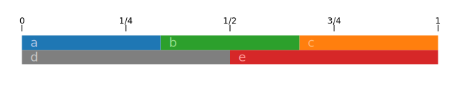
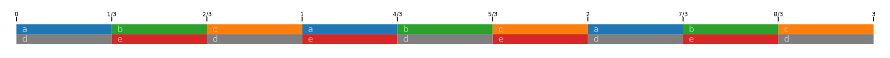

```{=html}
<style>
body {
  max-width: 60em;
}
img {
  max-width: none;
}
</style>
```

-   [Introduction](#introduction)
-   [Installing the Tidal library in
    Haskell](#installing-the-tidal-library-in-haskell)
    -   [Install via cabal](#install-via-cabal)
    -   [Alternative: install via stack](#alternative-install-via-stack)
    -   [Installing diagrams (optional, not needed for
        Tidal)](#installing-diagrams-optional-not-needed-for-tidal)
-   [Sanity checking the basic Tidal
    install](#sanity-checking-the-basic-tidal-install)
-   [Starting to look at some
    expressions](#starting-to-look-at-some-expressions)
-   [`Core.hs`](#core.hs)
-   [Queries](#queries)
    -   [Querying continuous patterns](#querying-continuous-patterns)
-   [Basic types (`Pattern.hs`)](#basic-types-pattern.hs)
-   [Patterns as numbers](#patterns-as-numbers)
-   [Pattern Algebra](#pattern-algebra)
-   [Applying a pattern of functions](#applying-a-pattern-of-functions)
-   [Mapping over a pattern](#mapping-over-a-pattern)
-   [Patterns of patterns](#patterns-of-patterns)
-   [Manually defining the query
    function](#manually-defining-the-query-function)
-   [Mini-Notation](#mini-notation)
-   [Querying events crossing cycle
    boundaries](#querying-events-crossing-cycle-boundaries)
-   [`ControlPattern` and `ValueMap`](#controlpattern-and-valuemap)
-   [The (#) operator](#the-operator)
-   [Layering parameter patterns to build up an event
    stream](#layering-parameter-patterns-to-build-up-an-event-stream)
-   [Booting Tidal from ghci](#booting-tidal-from-ghci)
-   [Inspecting OSC](#inspecting-osc)
-   [Continuous patterns](#continuous-patterns)
    -   [Setting event parameters from a continuous
        pattern](#setting-event-parameters-from-a-continuous-pattern)
-   [Deconstructing longer
    expressions](#deconstructing-longer-expressions)
-   [`UI.hs`](#ui.hs)
-   [`BootTidal.hs`](#boottidal.hs)
-   [Conclusion](#conclusion)
-   [See also](#see-also)
-   [Document Version](#document-version)

## Introduction

These are the notes I made when trying to first understand how [Tidal
Cycles](https://tidalcycles.org/) works.

This isn't about making sound! It's about trying to fundamentally
understand the expressions and values to have a good basis going
forward, and about getting started writing your own Tidal libraries. If
you're a musician and you just want to make music with Tidal, you don't
need this information.

This document ended up being more elaborate than I'd originally
intended. It gives an overview of Tidal's types and core APIs, shows how
to run it as a library from ghci, and explores some of its concepts. I
think the main contributions here are a relatively thorough survey of
the core code, the working code examples to try and to modify, and the
diagrams. Hopefully it will be helpful for developers trying to
understand Tidal.

## Installing the Tidal library in Haskell

MacOS \| Tidal Cycles`<br/>`{=html}
<https://tidalcycles.org/docs/getting-started/macos_install>

### Install via cabal

I tried installing a few different times in a few different ways, and
the method I preferred was the following:

-   Use `ghcup` (<https://www.haskell.org/ghcup/>)
    -   Install `ghc` with `ghcup`
    -   Add `$HOME/.ghcup/bin:$HOME/.ghcup/ghc/8.10.7/bin` to `$PATH` in
        `.bashrc`
    -   Install `cabal` with `ghcup`
    -   `cabal update`
    -   `cabal install tidal --lib`

NB: THIS IS NOT SUFFICIENT TO MAKE SOUND!! I'm only interested in
executing expressions and inspecting types at this stage. Look at the
installation instructions on [tidalcycles.org](https://tidalcycles.org)
for installing SuperCollider, SuperDirt and a compatible text editor,
which are all required for a typical install.

I initially had linker errors when compiling Haskell code. What I had to
do was uninstall ghc and cabal, uninstall all of my homebrew programs,
reinstall ghc and cabal, and then it worked. (It was fine to reinstall
homebrew for me since there was a lot of cruft left around that I'd just
kept upgrading over several years and OS versions.)

The `--lib` part is important. That makes it possible to run
`import Sound.Tidal.Context` in `ghci`.

You can delete `.ghc`, `.ghcup` and `.cabal` to start over from scratch
if you're trying to debug install problems.

### Alternative: install via stack

You can also use stack:

-   Run `stack setup`
    -   This will download the latest LTS version of GHC
    -   The LTS resolver version can be checked in
        `~/.stack/global-project/stack.yaml`: `resolver: lts-18.13`
    -   Go to <https://www.stackage.org> and click on LTS at the top to
        check the most recent stable version
    -   It ends up in `~/.stack/programs/x86_64-osx/ghc-8.10.7/bin/ghc`
        -   See `stack path`
    -   Invoke as `stack ghc` or `stack ghci`
-   `stack install --no-library-stripping tidal`

You can blow away `~/.stack` to reset your install for fixing
installation problems.

`--no-library-stripping` is important, since it's needed to import Tidal
inside a `ghci` session.

### Installing diagrams (optional, not needed for Tidal)

I also installed `diagrams` for making the diagrams. (You don't need to
do this.)

-   With cabal
    -   `cabal install diagrams-core --lib`
    -   `cabal install diagrams-lib --lib`
    -   `cabal install diagrams-svg --lib`
    -   `cabal install palette --lib`
-   With stack
    -   change your stack install to a nightly instead of LTS. The LTS
        one doesn't include diagrams for some reason.
    -   `stack install --no-library-stripping diagrams-core`
    -   `stack install --no-library-stripping diagrams-lib`
    -   `stack install --no-library-stripping diagrams-svg`
    -   `stack install --no-library-stripping palette`

I couldn't install the top-level `diagrams` library since I don't think
it worked with the `--lib` flag. (I would have to confirm that detail,
though.)

## Sanity checking the basic Tidal install

    $ ghci
    GHCi, version 8.10.7: https://www.haskell.org/ghc/  :? for help
    Loaded package environment from /.../.ghc/x86_64-darwin-8.10.7/environments/default
    Prelude> import Sound.Tidal.Context
    Prelude Sound.Tidal.Context> tidal_version
    "1.7.8"

## Starting to look at some expressions

This seems to work in the online examples but not in ghci:

    Prelude Sound.Tidal.Context> s $ "bd bd bd"

    <interactive>:3:5: error:
        • Couldn't match expected type ‘Pattern String’
                      with actual type ‘[Char]’
        • In the second argument of ‘($)’, namely ‘"bd bd bd"’
          In the expression: s $ "bd bd bd"
          In an equation for ‘it’: it = s $ "bd bd bd"

It needs `parseBP_E`, which is automatically, silently added when
running from the text editor. In a normal `ghci`:

    Prelude Sound.Tidal.Context> s $ parseBP_E "bd bd bd"
    (0>⅓)|s: "bd"
    (⅓>⅔)|s: "bd"
    (⅔>1)|s: "bd"

You can turn on the implicit string handling with
`{-# language OverloadedStrings #-}`, or the equivalent
`:set -XOverloadedStrings` in `ghci` (see Waldmann article below).

    GHCi, version 8.10.7: https://www.haskell.org/ghc/  :? for help
    Loaded package environment from /.../.ghc/x86_64-darwin-8.10.7/environments/default
    Prelude> import Sound.Tidal.Context
    Prelude Sound.Tidal.Context> :set -XOverloadedStrings
    Prelude Sound.Tidal.Context> s $ "bd bd bd"
    (0>⅓)|s: "bd"
    (⅓>⅔)|s: "bd"
    (⅔>1)|s: "bd"

`OverloadedStrings` is described at
<https://ghc.gitlab.haskell.org/ghc/doc/users_guide/exts/overloaded_strings.html>
. I'd prefer not to use it right now since I'm explicitly trying to
figure out the types and to understand the core definitions.

## `Core.hs`

The basic functions for making patterns are in `Pattern.hs`, `Core.hs`
and `UI.hs` (as far as I can tell).

Almost all the examples you see start from Tidal's pattern mini-language
(like `s $ "a b c"`), but that's not necessary for making patterns and
it's outside the core functionality. I'm going to start by surveying
some of the basic API in `Core.hs`.

There is API documentation online starting at
<https://tidalcycles.org/docs/patternlib/tour/concatenation>. (See
"Small Reference" at the left.)

A pattern is something you can query to get a list of events. Events
have extents in time and can carry an arbitrary kind of data. From
`Pattern.hs`:

    data Pattern a = Pattern {query :: State -> [Event a]}

    type Event a = EventF (ArcF Time) a

The most basic pattern is made via `pure`:

    Prelude Sound.Tidal.Context> pure "eventcontents" :: Pattern String
    (0>1)|"eventcontents"


So this is a pattern that has one event per cycle, and the event's
contents are the string `"eventcontents"`.

A cycle is some amount of time, like a bar, or say four bars of music.
You can set it to whatever you want, but it's the basic sync period for
a loop.

------------------------------------------------------------------------

You can make an empty pattern with `silence` (`Core.hs`), which is just
an alias for `empty` (`Pattern.hs`).

    Prelude Sound.Tidal.Context> silence

    Prelude Sound.Tidal.Context> :t silence
    silence :: Pattern a

(There are no events to print.)

------------------------------------------------------------------------

You can use `fromList` (`Core.hs`) to make a pattern where each list
item corresponds to an event with length one cycle:

    Prelude Sound.Tidal.Context> pat = fromList ["phi", "psi" , "tau"]
    Prelude Sound.Tidal.Context> pat
    (0>1)|"phi"
    Prelude Sound.Tidal.Context> putStrLn $ showAll (Arc 0 3) pat
    [](0>1)|"phi"
    [](1>2)|"psi"
    [](2>3)|"tau"
    Prelude Sound.Tidal.Context> :t pat
    pat :: Pattern [Char]


`showAll` from `Show.hs` takes an `Arc` argument, so we can print the
pattern over more than one cycle.

------------------------------------------------------------------------

Use `fastFromList` (`Core.hs`) to make a pattern that squeezes each list
item into one cycle:

    Prelude Sound.Tidal.Context> pat = fastFromList ["phi", "psi" , "tau"]
    Prelude Sound.Tidal.Context> pat
    (0>⅓)|"phi"
    (⅓>⅔)|"psi"
    (⅔>1)|"tau"
    Prelude Sound.Tidal.Context> :t pat
    pat :: Pattern [Char]


We can also draw the pattern on a circle to reflect its cyclical nature:


`listToPat` is a synonym from `fastFromList`.

------------------------------------------------------------------------

`fromMaybes` allows you to put gaps in the pattern:

    Prelude Sound.Tidal.Context> pat = fromMaybes [Just "phi", Nothing, Just "tau"]
    Prelude Sound.Tidal.Context> pat
    (0>⅓)|"phi"
    (⅔>1)|"tau"
    Prelude Sound.Tidal.Context> :t pat
    pat :: Pattern [Char]


------------------------------------------------------------------------

`append` alternates between cycles of two patterns.

    Prelude Sound.Tidal.Context> pat = append (fromList ['a', 'j']) (fromList ['c', 'k'])
    Prelude Sound.Tidal.Context> putStrLn $ showAll (Arc 0 8) pat
    [](0>1)|'a'
    [](1>2)|'c'
    [](2>3)|'j'
    [](3>4)|'k'
    [](4>5)|'a'
    [](5>6)|'c'
    [](6>7)|'j'
    [](7>8)|'k'
    Prelude Sound.Tidal.Context> :t pat
    pat :: Pattern Char


------------------------------------------------------------------------

`cat` alternates between cycles of several patterns.

    Prelude Sound.Tidal.Context> pat = cat [fromList ['a', 'j'], fromList ['c', 'k'], fromList ['e', 'l']]
    Prelude Sound.Tidal.Context> putStrLn $ showAll (Arc 0 8) pat
    [](0>1)|'a'
    [](1>2)|'c'
    [](2>3)|'e'
    [](3>4)|'j'
    [](4>5)|'k'
    [](5>6)|'l'
    [](6>7)|'a'
    [](7>8)|'c'
    Prelude Sound.Tidal.Context> :t pat
    pat :: Pattern Char


`slowCat` and `slowcat` (lowercase) are aliases for `cat`.

------------------------------------------------------------------------

`fastCat` (also `fastcat`), works like `cat` but squeezes all the
patterns into one cycle

    Prelude Sound.Tidal.Context> pat = fastCat [fromList ['a', 'j'], fromList ['c', 'k'], fromList ['e', 'l']]
    Prelude Sound.Tidal.Context> putStrLn $ showAll (Arc 0 3) pat
    [](0>⅓)|'a'
    [](⅓>⅔)|'c'
    [](⅔>1)|'e'
    [](1>1⅓)|'j'
    [](1⅓>1⅔)|'k'
    [](1⅔>2)|'l'
    [](2>2⅓)|'a'
    [](2⅓>2⅔)|'c'
    [](2⅔>3)|'e'
    Prelude Sound.Tidal.Context> :t pat
    pat :: Pattern Char


------------------------------------------------------------------------

`timeCat` takes patterns and squeezes them into parts of a cycle. The
time argument for each pattern is its relative duration.

    Prelude Sound.Tidal.Context> timeCat [(1, fastFromList ['a', 'b']), (2, fastFromList ['c', 'd', 'e'])]
      (0>⅙)|'a'
      (⅙>⅓)|'b'
     (⅓>⁵₉)|'c'
    (⁵₉>⁷₉)|'d'
     (⁷₉>1)|'e'


You could imagine using this for creating events of arbitrary lengths.

------------------------------------------------------------------------

`overlay` superimposes two patterns, playing them in parallel.

    Prelude Sound.Tidal.Context> overlay (fastFromList ['a', 'b', 'c', 'd']) (fastFromList ['j', 'k', 'l'])
    (0>¼)|'a'
    (0>⅓)|'j'
    (¼>½)|'b'
    (⅓>⅔)|'k'
    (½>¾)|'c'
    (⅔>1)|'l'
    (¾>1)|'d'


------------------------------------------------------------------------

`stack` superimposes a list of patterns.

    Prelude Sound.Tidal.Context> stack [pure 'a', fastFromList ['j', 'k', 'l'], fromList ['m', 'n']]
    (0>⅓)|'j'
    (0>1)|'a'
    (0>1)|'m'
    (⅓>⅔)|'k'
    (⅔>1)|'l'


------------------------------------------------------------------------

`fast` speeds things up

    Prelude Sound.Tidal.Context> fast 3 $ fastFromList ['a', 'b', 'c']
      (0>⅑)|'a'
     (⅑>²₉)|'b'
     (²₉>⅓)|'c'
     (⅓>⁴₉)|'a'
    (⁴₉>⁵₉)|'b'
     (⁵₉>⅔)|'c'
     (⅔>⁷₉)|'a'
    (⁷₉>⁸₉)|'b'
     (⁸₉>1)|'c'
    Prelude Sound.Tidal.Context> drawLine $ fast 3 $ fastFromList ['a', 'b', 'c']

    [7 cycles]
    |abcabcabc|abcabcabc|abcabcabc|abcabcabc|abcabcabc|abcabcabc|abcabcabc


`drawLine` is a utility function from `Show.hs` that renders out a
`Pattern Char` as ascii art. It only works on char patterns!

------------------------------------------------------------------------

`slow` elongates (i.e., slows down) a pattern

    Prelude Sound.Tidal.Context> slow 2 $ fastFromList ['a', 'a', 'b', 'c']
    (0>½)|'a'
    (½>1)|'a'
    Prelude Sound.Tidal.Context> drawLine $ slow 2 $ fastFromList ['a', 'a', 'b', 'c']

    [26 cycles]
    |aa|bc|aa|bc|aa|bc|aa|bc|aa|bc|aa|bc|aa|bc|aa|bc|aa|bc|aa|bc|aa|bc|aa|bc|aa|bc


------------------------------------------------------------------------

`fastGap` speeds things up but aligns to the cycle

    Prelude Sound.Tidal.Context> fastGap 3 $ fastFromList ['a', 'b', 'c']
     (0>⅑)|'a'
    (⅑>²₉)|'b'
    (²₉>⅓)|'c'
    Prelude Sound.Tidal.Context> drawLine $ fastGap 3 $ fastFromList ['a', 'b', 'c']

    [7 cycles]
    |abc......|abc......|abc......|abc......|abc......|abc......|abc......


------------------------------------------------------------------------

`compress` squeezes a pattern into a given arc of time

    Prelude Sound.Tidal.Context> compress (1/4,1/2) $ fastFromList ['a', 'b', 'c']
       (¼>⅓)|'a'
    (⅓>5/12)|'b'
    (5/12>½)|'c'
    Prelude Sound.Tidal.Context> drawLine $ compress (1/4,1/2) $ fastFromList ['a', 'b', 'c']

    [6 cycles]
    |...abc......|...abc......|...abc......|...abc......|...abc......|...abc......


------------------------------------------------------------------------

`zoom` zooms in on a portion of a pattern. It maps the zoomed portion to
the duration of the input pattern.

    Prelude Sound.Tidal.Context> zoom (1/4,3/4) $ fastFromList ['a', 'b', 'c']
    -1½-(0>⅙)|'a'
        (⅙>⅚)|'b'
     (⅚>1)-1½|'c'
    Prelude Sound.Tidal.Context> drawLine $ zoom (1/4,3/4) $ fastFromList ['a', 'b', 'c']

    [11 cycles]
    |a----c|a----c|a----c|a----c|a----c|a----c|a----c|a----c|a----c|a----c|a----c


(I don't know why the "b" event isn't shown in the `drawLine` output
above.)

------------------------------------------------------------------------

`rev` reverses each cycle of a pattern

    Prelude Sound.Tidal.Context> rev $ slow 2 $ fromMaybes [Just 'a', Nothing, Just 'b', Nothing, Nothing, Just 'c']
    (0>⅓)|'b'
    (⅔>1)|'a'
    Prelude Sound.Tidal.Context> drawLine $ rev $ slow 2 $ fromMaybes [Just 'a', Nothing, Just 'b', Nothing, Nothing, Just 'c']

    [19 cycles]
    |b.a|c..|b.a|c..|b.a|c..|b.a|c..|b.a|c..|b.a|c..|b.a|c..|b.a|c..|b.a|c..|b.a

Input
(`slow 2 $ fromMaybes [Just 'a', Nothing, Just 'b', Nothing, Nothing, Just 'c']`):


Output
(`rev $ slow 2 $ fromMaybes [Just 'a', Nothing, Just 'b', Nothing, Nothing, Just 'c']`):


------------------------------------------------------------------------

`every` applies a function to the input pattern, but only every `n`
cycles.

    Prelude Sound.Tidal.Context> every 3 rev $ fastFromList ['a', 'b', 'c']
    (0>⅓)|'c'
    (⅓>⅔)|'b'
    (⅔>1)|'a'
    Prelude Sound.Tidal.Context> drawLine $ every 3 rev $ fastFromList ['a', 'b', 'c']

    [19 cycles]
    |cba|abc|abc|cba|abc|abc|cba|abc|abc|cba|abc|abc|cba|abc|abc|cba|abc|abc|cba


The '`n` cycles' argument is actually of type `Pattern Int`, so you can
vary the argument over time like this:

    Prelude Sound.Tidal.Context> pat = fastFromList ['a', 'b', 'c']
    Prelude Sound.Tidal.Context> ints = slow 6 $ cat [2, 3]
    Prelude Sound.Tidal.Context> drawLine $ every ints rev pat

    [19 cycles]
    |cba|abc|cba|abc|cba|abc|cba|abc|abc|cba|abc|abc|cba|abc|cba|abc|cba|abc|cba

For the first six cycles the pattern is reversed every two repetitions;
for the second six cycles the pattern is reversed every three.

------------------------------------------------------------------------

`when` applies a function when the given predicate function returns
true. The predicate is fed the current cycle number.

    Prelude Sound.Tidal.Context> drawLine $ when (\x -> (x+2) `mod` 3 == 0) rev (fastFromList ['a','b','c'])

    [19 cycles]
    |abc|cba|abc|abc|cba|abc|abc|cba|abc|abc|cba|abc|abc|cba|abc|abc|cba|abc|abc


------------------------------------------------------------------------

`rotR` shifts a pattern forward in time by a certain number of cycles.

    Prelude Sound.Tidal.Context> drawLine $ rotR (1%3) (fastFromList ['a', 'b', 'c'])

    [19 cycles]
    |cab|cab|cab|cab|cab|cab|cab|cab|cab|cab|cab|cab|cab|cab|cab|cab|cab|cab|cab


You can use `rotR` and `fastGap` to manually put an event at a
particular point in time with a particular duration.

    Prelude Sound.Tidal.Context> rotR (3%8) (fastGap 4 (pure 'a'))
    (⅜>⅝)|'a'


## Queries

Patterns can be queried over a time range, returning a list of events.
The scheduler does this repeatedly over small time slices to decide when
to send OSC ([Open Sound
Control](https://en.wikipedia.org/wiki/Open_Sound_Control)) messages to
SuperCollider. We can use this to check how our pattern will be
rendered.

Each `Pattern` implements `query`:

    data Pattern a = Pattern {query :: State -> [Event a]}

    data State = State {arc :: Arc,
                        controls :: ValueMap
                       }

You pass in a `State`, but for our purposes we'll always leave
`controls` empty. (I understand it to be the current values of any
external MIDI controllers, which we don't need.) That means `query`
essentially goes from an `Arc` of time to a list of `Event`s; that's
exactly what `queryArc` does:

    queryArc :: Pattern a -> Arc -> [Event a]
    queryArc p a = query p $ State a Map.empty

The events that are returned have a `whole` and a `part`, which we'll
get into later.

------------------------------------------------------------------------

    Prelude Sound.Tidal.Context> queryArc (fromMaybes [Nothing,Just 'a', Nothing, Just 'c', Just 'd']) (Arc 0 1)
    [[](⅕>⅖)|'a',[](⅗>⅘)|'c',[](⅘>1)|'d']


In this example, each of the output events has a `whole`, and that
`whole` is the same as its `part`.

------------------------------------------------------------------------

    Prelude Sound.Tidal.Context> queryArc (fromMaybes [Nothing,Just 'a', Nothing, Just 'c', Just 'd']) (Arc 0 0.5)
    [[](⅕>⅖)|'a']


------------------------------------------------------------------------

    Prelude Sound.Tidal.Context> queryArc (fromMaybes [Nothing,Just 'a', Nothing, Just 'c', Just 'd']) (Arc 0 0.25)
    [[](⅕>¼)-⅖|'a']


So we see here that the output `Event`'s `whole` is the entire extent of
the input event that intersects with the query `Arc`; the `part` is the
intersection of the query `Arc` and the overlapping input event.

We see `(⅕>¼)-⅖` in the ghci output. The way to read this is

-   `(⅕>¼)` is the part, where the query window overlaps with the input
    event window,
-   `⅕` to `⅖` is the whole, and
-   `(⅕>¼)-⅖` is a representation that combines both the part and the
    whole

------------------------------------------------------------------------

    Prelude Sound.Tidal.Context> queryArc (fromMaybes [Nothing,Just 'a', Nothing, Just 'c', Just 'd']) (Arc 0 0.2)
    []


Querying an arc that doesn't overlap any pattern events returns an empty
list. Note here that the right edge of the query arc touches the first
pattern event.

------------------------------------------------------------------------

    Prelude Sound.Tidal.Context> queryArc (fromMaybes [Nothing,Just 'a', Nothing, Just 'c', Just 'd']) (Arc 0.6 0.8)
    [[](⅗>⅘)|'c']


------------------------------------------------------------------------

    Prelude Sound.Tidal.Context> queryArc (fromMaybes [Nothing,Just 'a', Nothing, Just 'c', Just 'd']) (Arc 0.8 1.0)
    [[](⅘>1)|'d']


------------------------------------------------------------------------

    Prelude Sound.Tidal.Context> queryArc (fromMaybes [Nothing,Just 'a', Nothing, Just 'c', Just 'd']) (Arc 0.6 1.0)
    [[](⅗>⅘)|'c',[](⅘>1)|'d']


------------------------------------------------------------------------

    Prelude Sound.Tidal.Context> queryArc (fromMaybes [Nothing,Just 'a', Nothing, Just 'c', Just 'd']) (Arc 0.7 0.9)
    [[]⅗-(7/10>⅘)|'c',[](⅘>9/10)-1|'d']


------------------------------------------------------------------------

    Prelude Sound.Tidal.Context> queryArc (fromMaybes [Nothing,Just 'a', Nothing, Just 'c', Just 'd']) (Arc 0.8 0.8)
    [[](⅘>⅘)-1|'d']


So if you query a zero-width arc right between two events, it returns
only the second event (with a zero-width part).

------------------------------------------------------------------------

    Prelude Sound.Tidal.Context> queryArc (fromMaybes [Nothing,Just 'a', Nothing, Just 'c', Just 'd']) (Arc 0.75 0.75)
    [[]⅗-(¾>¾)-⅘|'c']


Note here how the event's extents are notated: `⅗-(¾>¾)-⅘`.

### Querying continuous patterns

Tidal also has a concept of a continuous pattern.


(This is `sine` from `Core.hs`.)

These patterns accept `query` like any other pattern.

    Prelude Sound.Tidal.Context> queryArc sine (Arc 0.5 0.75)
    [[]~½>¾~|0.14644660940672627]


Let's look into the details to see what the query is returning and where
the floating point value is coming from.

    Prelude Sound.Tidal.Context> results = queryArc sine (Arc 0.5 0.75)
    Prelude Sound.Tidal.Context> results
    [[]~½>¾~|0.14644660940672627]
    Prelude Sound.Tidal.Context> :t results
    results :: Fractional a => [Event a]
    Prelude Sound.Tidal.Context> length results
    1
    Prelude Sound.Tidal.Context> event : _ = results
    Prelude Sound.Tidal.Context> :t event
    event :: Fractional a => Event a
    Prelude Sound.Tidal.Context> whole event
    Nothing
    Prelude Sound.Tidal.Context> part event
    ½>¾
    Prelude Sound.Tidal.Context> value event
    0.14644660940672627


So we see that querying a continuous pattern returns events with parts
and values, but no wholes.

The notation for continuous results includes tildes: `~½>¾~`.

Note too that the query samples the continuous function in the middle of
the query arc.

    Prelude Sound.Tidal.Context> queryArc sine (Arc 0.3 0.5)
    [[]~3/10>½~|0.7938926261462367]
    Prelude Sound.Tidal.Context> queryArc sine (0.4 :: Arc)
    [[]~⅖>⅖~|0.7938926261462367]


If you want to sample a continuous pattern at exactly one point, use a
zero-width arc.

    Prelude Sound.Tidal.Context> queryArc sine (Arc 0.22 0.22)
    [[]~11/50>11/50~|0.9911436253643443]


Tidal calls continuous patterns "analog" and discrete patterns
"digital":

    isAnalog :: Event a -> Bool
    isAnalog (Event {whole = Nothing}) = True
    isAnalog _ = False

    isDigital :: Event a -> Bool
    isDigital = not . isAnalog

(from `Pattern.hs`)

## Basic types (`Pattern.hs`)

We've seen several examples of patterns, events and queries. Hopefully
that will have built up enough intuition to make sense of the basic
types.

`Pattern` is defined in `Sound/Tidal/Pattern.hs`.

    -- | A datatype representing events taking place over time
    data Pattern a = Pattern {query :: State -> [Event a]}
      deriving (Generic, Functor)

A pattern is something that can be queried, returning a list of events.

An `Arc` is an interval of time. Time is expressed as a rational (i.e.,
a fraction) (defined in `Sound/Tidal/Time.hs`)

    -- | Time is rational
    type Time = Rational

    -- | An arc of time, with a start time (or onset) and a stop time (or offset)
    data ArcF a = Arc
      { start :: a
      , stop :: a
      } deriving (Eq, Ord, Functor, Show, Generic)

    type Arc = ArcF Time

I think the reason it's called an arc is that a cycle is imagined to lie
on a circle. An arc is a portion of that circle.

`Event`s are defined thusly (see `Sound/Tidal/Pattern.hs`):

    -- | An event is a value that's active during a timespan. If a whole
    -- is present, the part should be equal to or fit inside it.
    data EventF a b = Event
      { context :: Context
      , whole :: Maybe a
      , part :: a
      , value :: b
      } deriving (Eq, Ord, Functor, Generic)

    type Event a = EventF (ArcF Time) a

So events are understood to be boxes on the timeline with a beginning
and an end, which contain a value. We also have the notion of looking at
a subsection of an event, hence the `whole` and `part` distinction.
`whole` is `Maybe a`, so it might be `Nothing`, which means that it's
from an analog (continuous) pattern.

`value` is, of course, the value that the event contains.

The context is apparently the position within the source code. I guess
this is used when interpreting expressions in a live coding context.

There are some utility functions to access an event's fields in
`Pattern.hs`: `isAnalog`, `isDigital`, `wholeStart`, `wholeStop`,
`eventPartStart`, `eventPartStop`, etc.

## Patterns as numbers

You can perform many operations on patterns as though they were numbers:

    Prelude Sound.Tidal.Context> min 27 $ fastFromList [11,22,33,44]
    (0>¼)|11
    (¼>½)|22
    (½>¾)|27
    (¾>1)|27


    Prelude Sound.Tidal.Context> max 27 $ fastFromList [11,22,33,44]
    (0>¼)|27
    (¼>½)|27
    (½>¾)|33
    (¾>1)|44


    Prelude Sound.Tidal.Context> fastFromList [11,22,33,44] + 3
    (0>¼)|14
    (¼>½)|25
    (½>¾)|36
    (¾>1)|47


    Prelude Sound.Tidal.Context> 2 * fastFromList [11,22,33,44]
    (0>¼)|22
    (¼>½)|44
    (½>¾)|66
    (¾>1)|88


    Prelude Sound.Tidal.Context> mod (fastFromList [11,22,33,44]) 4
    (0>¼)|3
    (¼>½)|2
    (½>¾)|1
    (¾>1)|0


    Prelude Sound.Tidal.Context> sqrt $ fastFromList [2,9,16,100]
    (0>¼)|1.4142135623730951
    (¼>½)|3.0
    (½>¾)|4.0
    (¾>1)|10.0


Neat.

## Pattern Algebra

What happens when we straight up add two patterns together?

    Prelude Sound.Tidal.Context> fastFromList [1, 2, 3] + fastFromList [20, 40] :: Pattern Int
    (0>⅓)|21
    (⅓>½)|22
    (½>⅔)|42
    (⅔>1)|43


Tidal adds the patterns together by combining the events and values from
both input patterns. Internally, Tidal does the addition via
`applyPatToPatBoth` in `Pattern.hs`.

There are other addition operators that combine the events in alternate
ways that call `applyPatToPatLeft` and `applyPatToPatRight` instead.

The `(|+)` operator is addition, taking structure (i.e., the wholes)
from the left (`src/Sound/Tidal/Core.hs`).

    Prelude Sound.Tidal.Context> fastFromList [1, 2, 3] |+ fastFromList [20, 40] :: Pattern Int
      (0>⅓)|21
    (⅓>½)-⅔|22
    ⅓-(½>⅔)|42
      (⅔>1)|43


(In the text output, notice that the "22" and the "42" entries
correspond to the same whole event. I understand this to mean that the
value changes midway though the event, but the onset still happens at
the "22" in this case. I later confirmed with `oscdump` and a live Tidal
REPL that that's what's happening -- the value that is lined up when the
onset happens is the one that gets sent. The change midway through the
event does nothing.)

    Prelude Sound.Tidal.Context> fastFromList [1, 2, 3] |+ fastFromList [20, 40, 60] :: Pattern Int
    (0>⅓)|21
    (⅓>⅔)|42
    (⅔>1)|63


    Prelude Sound.Tidal.Context> fastFromList [1, 2, 3] |+ fastFromList [20, 40, 60, 80] :: Pattern Int
    (0>¼)-⅓|21
    0-(¼>⅓)|41
    (⅓>½)-⅔|42
    ⅓-(½>⅔)|62
    (⅔>¾)-1|63
    ⅔-(¾>1)|83


------------------------------------------------------------------------

The `+|` operator does addition, but takes the events from the right
argument:


------------------------------------------------------------------------

The `|+|` operator does addition, but takes the events from both
arguments:


------------------------------------------------------------------------

If you use `+`, it's like `|+|`:


------------------------------------------------------------------------

There are a bunch of operators that work in the same way documented at
<https://tidalcycles.org/docs/patternlib/tutorials/pattern_structure>.

## Applying a pattern of functions

The above are examples of `Pattern`'s `Applicative` instance, which is a
Haskell thing. It allows you to apply a pattern of unary functions to a
pattern of arguments.

    instance Applicative Pattern where
      -- | Repeat the given value once per cycle, forever
      pure v = Pattern $ \(State a _) ->
        map (\a' -> Event (Context []) (Just a') (sect a a') v) $ cycleArcsInArc a

      (<*>) = applyPatToPatBoth

    Prelude Sound.Tidal.Context> a = fastFromList [ (2.0*), exp, (max 7) ]
    Prelude Sound.Tidal.Context> :t a
    a :: (Floating a, Ord a) => Pattern (a -> a)
    Prelude Sound.Tidal.Context> b = fastFromList [1, 2]
    Prelude Sound.Tidal.Context> a <*> b
    (0>⅓)|2.0
    (⅓>½)|2.718281828459045
    (½>⅔)|7.38905609893065
    (⅔>1)|7.0


There are also the operators `<*` and `*>`, which take the structure
from the left and right, respectively.

    Prelude> import Prelude hiding ((<*), (*>))
    Prelude> import Sound.Tidal.Context
    Prelude Sound.Tidal.Context> a = fastFromList [ (2.0*), exp, (max 7) ]
    Prelude Sound.Tidal.Context> b = fastFromList [1, 2]
    Prelude Sound.Tidal.Context> a <* b
      (0>⅓)|2.0
    (⅓>½)-⅔|2.718281828459045
    ⅓-(½>⅔)|7.38905609893065
      (⅔>1)|7.0


    Prelude Sound.Tidal.Context> a *> b
    (0>⅓)-½|2.0
    0-(⅓>½)|2.718281828459045
    (½>⅔)-1|7.38905609893065
    ½-(⅔>1)|7.0


(Only the first event contains the whole's onset, so that's the one
that'll get sent out via OSC.)

These operators are the more general ones that are called into by `|+`,
`+|`, etc.

## Mapping over a pattern

You can map a function over a `Pattern`. It'll apply the function to
that pattern's events.

    Prelude Sound.Tidal.Context> fmap abs fastFromList [ 2, -3, 1, -1, 4 ]
    (0>⅕)|2
    (⅕>⅖)|3
    (⅖>⅗)|1
    (⅗>⅘)|1
    (⅘>1)|4
    Prelude Sound.Tidal.Context> fmap ((+3) . (*2)) fastFromList [ 1, 2, 3, 4 ]
    (0>¼)|5
    (¼>½)|7
    (½>¾)|9
    (¾>1)|11

There are also various filter functions defined in `Pattern.hs`.

    Prelude Sound.Tidal.Context> filterValues (> 0) $ fastFromList [ 2, -3, 1, -1, 4 ]
    (0>⅕)|2
    (⅖>⅗)|1
    (⅘>1)|4


See `filterJust`, `filterWhen`, `filterOnsets`, `filterEvents`, etc.

## Patterns of patterns

You can of course define patterns of patterns as well.

    Prelude Sound.Tidal.Context> pat = fastFromList [ fastFromList ['a','b','c'], fastFromList ['d','e'] ]
    Prelude Sound.Tidal.Context> pat
    (0>½)|(0>⅓)|'a'
    (⅓>⅔)|'b'
    (⅔>1)|'c'
    (½>1)|(0>½)|'d'
    (½>1)|'e'
    Prelude Sound.Tidal.Context> :t pat
    pat :: Pattern (Pattern Char)

The way to read this is that there's one event on `(0>½)` that contains
the first pattern, and there's a second event on `(½>1)` that contains
the second pattern.

------------------------------------------------------------------------

You can use `unwrap` if you want to flatten the patterns:

    Prelude Sound.Tidal.Context> pat = unwrap $ fastFromList [ fastFromList ['a','b','c'], fastFromList ['j','k','l','m'] ]
    Prelude Sound.Tidal.Context> pat
    (0>⅓)|'a'
    (⅓>½)|'b'
    (½>¾)|'l'
    (¾>1)|'m'
    Prelude Sound.Tidal.Context> :t pat
    pat :: Pattern Char


So this is allowing the inner patterns to shine through the windows
defined by the events they're contained in. The wholes and the parts are
cleaned up so that they're coincident for every event.

------------------------------------------------------------------------

`innerJoin` flattens the pattern but takes the structure from the inner
pattern.

    Prelude Sound.Tidal.Context> innerJoin $ fastFromList [ fastFromList ['a','b','c'], fastFromList ['j','k','l','m'] ]
      (0>⅓)|'a'
    (⅓>½)-⅔|'b'
      (½>¾)|'l'
      (¾>1)|'m'


The events are defined by the inner patterns over the entire cycle, and
those windowed by the outer events they're contained in. This looks like
the `unwrap` case, but the wholes from the inner pattern are preserved
in the output events.

We can emulate this with `queryArc` to help understand what `innerJoin`
is doing:

    Prelude Sound.Tidal.Context> queryArc (fastFromList ['a','b','c']) (Arc 0 0.5) ++ queryArc (fastFromList ['j','k','l','m']) (Arc 0.5 1)
    [[](0>⅓)|'a',[](⅓>½)-⅔|'b',[](½>¾)|'l',[](¾>1)|'m']

------------------------------------------------------------------------

`outerJoin` flattens the pattern but takes the structure from the outer
pattern.

    Prelude Sound.Tidal.Context> outerJoin $ fastFromList [ fastFromList ['a','b','c'], fastFromList ['j','k','l','m'] ]
    (0>½)|'a'
    (½>1)|'l'


Note that the wholes come from the outer pattern.

------------------------------------------------------------------------

Finally, there's `squeezeJoin`, which compresses each of the inner
patterns into the event they're contained in.

    Prelude Sound.Tidal.Context> squeezeJoin $ fastFromList [ fastFromList ['a','b','c'], fastFromList ['j','k','l','m'] ]
    (0>⅙)|'a'
    (⅙>⅓)|'b'
    (⅓>½)|'c'
    (½>⅝)|'j'
    (⅝>¾)|'k'
    (¾>⅞)|'l'
    (⅞>1)|'m'


## Manually defining the query function

Since patterns basically only provide a query function, you can write
one yourself instead of using the API we've explored so far.

Here's a trivial example:

    Prelude Sound.Tidal.Context> pat = Pattern { query = \s -> [] }
    Prelude Sound.Tidal.Context> queryArc pat (Arc 0 1)
    []
    Prelude Sound.Tidal.Context> queryArc pat (Arc 1 100)
    []
    Prelude Sound.Tidal.Context> queryArc pat (Arc 7 7)
    []

(`empty` is defined as `empty = Pattern {query = const []}` in
`Pattern.hs`.)

Set the value from the query arc's start time:

    Prelude Sound.Tidal.Context> pat = Pattern { query = \(State a ctrls) -> [Event (Context []) (Just a) a (fromRational $ start a :: Double)] }
    Prelude Sound.Tidal.Context> queryArc pat (Arc 0 1)
    [[](0>1)|0.0]
    Prelude Sound.Tidal.Context> queryArc pat (Arc 1 100)
    [[](1>100)|1.0]
    Prelude Sound.Tidal.Context> queryArc pat (Arc 7 7)
    [[](7>7)|7.0]

Return events whose value is the cycle number:

    Prelude Sound.Tidal.Context> :{
    Prelude Sound.Tidal.Context| pat = Pattern { query = \(State a _) ->
    Prelude Sound.Tidal.Context|     map
    Prelude Sound.Tidal.Context|         (\cyclearc -> Event
    Prelude Sound.Tidal.Context|             (Context [])
    Prelude Sound.Tidal.Context|             (Just cyclearc)
    Prelude Sound.Tidal.Context|             (sect a cyclearc)
    Prelude Sound.Tidal.Context|             (fromRational $ sam $ start cyclearc :: Double))
    Prelude Sound.Tidal.Context|         (cycleArcsInArc a) }
    Prelude Sound.Tidal.Context| :}
    Prelude Sound.Tidal.Context> queryArc pat (Arc 0 3)
    [[](0>1)|0.0,[](1>2)|1.0,[](2>3)|2.0]
    Prelude Sound.Tidal.Context> queryArc pat (Arc 5 9)
    [[](5>6)|5.0,[](6>7)|6.0,[](7>8)|7.0,[](8>9)|8.0]
    Prelude Sound.Tidal.Context> queryArc pat (Arc 7.5 9.5)
    [[]7-(7½>8)|7.0,[](8>9)|8.0,[](9>9½)-10|9.0]

(The `:{` and `:}` lines are for ghci, to have the definition span
multiple lines.)

A pattern with zero events in the zeroth cycle, one event in the first,
two events in the second, etc.:

    Prelude Sound.Tidal.Context> :{
    Prelude Sound.Tidal.Context| pat = Pattern { query = \s ->
    Prelude Sound.Tidal.Context|     let
    Prelude Sound.Tidal.Context|         subpattern :: Int -> Pattern Int
    Prelude Sound.Tidal.Context|         subpattern = \i -> fast (fromIntegral i) $ pure i
    Prelude Sound.Tidal.Context|         outterpattern :: Pattern (Pattern Int)
    Prelude Sound.Tidal.Context|         outterpattern = fromList $ map subpattern [0,1..5]
    Prelude Sound.Tidal.Context|     in
    Prelude Sound.Tidal.Context|         query (unwrap outterpattern) s }
    Prelude Sound.Tidal.Context| :}
    Prelude Sound.Tidal.Context> queryArc pat (Arc 0 7)
    [[](1>2)|1,[](2>2½)|2,[](2½>3)|2,[](3>3⅓)|3,[](3⅓>3⅔)|3,[](3⅔>4)|3,[](4>4¼)|4,[](4¼>4½)|4,[](4½>4¾)|4,[](4¾>5)|4,[](5>5⅕)|5,[](5⅕>5⅖)|5,[](5⅖>5⅗)|5,[](5⅗>5⅘)|5,[](5⅘>6)|5]

And so on.

(This last example can be done in a one-liner with
`pat = unwrap (fromList $ map (\i -> fast (fromIntegral i) $ pure i) [0,1..5])`;
going through the `query` here is actually unnecessary, but you get the
idea)

The part for each event must fit inside its whole.

These functions are executed every time the pattern is queried. They
shouldn't be computationally expensive so they can be rendered in real
time. Also, it seems that you can't rely on them being lazily evaluated
(there seems to be be some strictness somewhere during evaluation).
Using `[0..]` above instead of `[0,1..5]` hung ghci for me.

You can put a long function expression in a text file with a `.hs`
extension and load it in a ghci session using `:load` and `:reload`
(`:l` and `:r`).

## Mini-Notation

So this is sort of the main event. Tidal includes a "mini-notation" for
succinctly specifying patterns as text strings. Most of the examples you
see will start with this format.

It's functionality that sits on top of `Sound.Tidal.Pattern` and
`Sound.Tidal.Core`, so I felt it was less fundamental and left it until
now. It's defined in `ParseBP.hs`.

So as we saw in 'Starting to look at some expressions' above,
expressions like `s "bd ~ bd ~"` don't work in ghci by default. You need
to add `parseBP_E` or turn on implicit string handling with
`:set -XOverloadedStrings`. This will be already turned on in Tidal
proper. For the examples here I'll include `parseBP_E` explicitly for
the sake of understanding and driving the point home.

See <https://tidalcycles.org/docs/patternlib/tutorials/mini_notation>
for further notes on the syntax more examples.

------------------------------------------------------------------------

So the most basic pattern just lists the event values in a string.
They're compressed into one cycle, like with `fastFromList`.

    Prelude Sound.Tidal.Context> parseBP_E "a b c" :: Pattern Char
    (0>⅓)|'a'
    (⅓>⅔)|'b'
    (⅔>1)|'c'
    Prelude Sound.Tidal.Context> drawLine $ parseBP_E "a b c"

    [19 cycles]
    |abc|abc|abc|abc|abc|abc|abc|abc|abc|abc|abc|abc|abc|abc|abc|abc|abc|abc|abc


There are some things to note here. The type of the values is inferred
from the outer type annotation. To wit:

    Prelude Sound.Tidal.Context> :set +t
    Prelude Sound.Tidal.Context> parseBP_E "1 2 3" :: Pattern Double
    (0>⅓)|1.0
    (⅓>⅔)|2.0
    (⅔>1)|3.0
    it :: Pattern Double
    Prelude Sound.Tidal.Context> parseBP_E "1 2 3" :: Pattern Char
    (0>⅓)|'1'
    (⅓>⅔)|'2'
    (⅔>1)|'3'
    it :: Pattern Char
    Prelude Sound.Tidal.Context> parseBP_E "1 2 3" :: Pattern Int
    (0>⅓)|1
    (⅓>⅔)|2
    (⅔>1)|3
    it :: Pattern Int
    Prelude Sound.Tidal.Context> parseBP_E "1 0 0 1" :: Pattern Bool
    (0>¼)|True
    (¼>½)|False
    (½>¾)|False
    (¾>1)|True
    it :: Pattern Bool

If you don't give a type hint, it'll fall back to a default type for the
values.

    Prelude Sound.Tidal.Context> parseBP_E "e f g"
    (0>⅓)|4
    (⅓>⅔)|5
    (⅔>1)|7
    it :: (Enumerable a, Parseable a) => Pattern a

If you omit the type hint some characters just don't work.

    Prelude Sound.Tidal.Context> parseBP_E "j k l" :: Pattern Char
    (0>⅓)|'j'
    (⅓>⅔)|'k'
    (⅔>1)|'l'
    it :: Pattern Char
    Prelude Sound.Tidal.Context> parseBP_E "j k l"
    *** Exception: Syntax error in sequence:
      "j k l"
       ^  
    unexpected 'j'
    expecting white space, "-", "+", number, "c", "d", "e", "f", "g", "a", "b", "'", rest, "[", "{", "<", "^", ".", "?" or end of input

Also, `drawLine` expects a pattern of type `Pattern Char`. So you can't
use it to show patterns of strings, for example.

------------------------------------------------------------------------

Onward with more mini-notation. Tilde is a rest:

    Prelude Sound.Tidal.Context> parseBP_E "b ~ b ~" :: Pattern Char
    (0>¼)|'b'
    (½>¾)|'b'
    Prelude Sound.Tidal.Context> drawLine $ parseBP_E "b ~ b ~"

    [15 cycles]
    |b.b.|b.b.|b.b.|b.b.|b.b.|b.b.|b.b.|b.b.|b.b.|b.b.|b.b.|b.b.|b.b.|b.b.|b.b.

So a dot in the `drawLine` output is a rest.


------------------------------------------------------------------------

Underscore elongates a note:

    Prelude Sound.Tidal.Context> parseBP_E "a _ c" :: Pattern Char
    (0>⅔)|'a'
    (⅔>1)|'c'
    Prelude Sound.Tidal.Context> drawLine $ parseBP_E "a _ c"

    [19 cycles]
    |a-c|a-c|a-c|a-c|a-c|a-c|a-c|a-c|a-c|a-c|a-c|a-c|a-c|a-c|a-c|a-c|a-c|a-c|a-c

A hyphen in the `drawLine` output means that a note is held for an extra
division.


------------------------------------------------------------------------

`@` elongates a pattern by some number of counts:

    Prelude Sound.Tidal.Context> parseBP_E "a@3 b" :: Pattern Char
    (0>¾)|'a'
    (¾>1)|'b'
    Prelude Sound.Tidal.Context> drawLine $ parseBP_E "a@3 b"

    [15 cycles]
    |a--b|a--b|a--b|a--b|a--b|a--b|a--b|a--b|a--b|a--b|a--b|a--b|a--b|a--b|a--b


------------------------------------------------------------------------

Repeat an event with \* . Notice how it takes the time the event would
have taken and subdivides that:

    Prelude Sound.Tidal.Context> parseBP_E "a*2 c" :: Pattern Char
    (0>¼)|'a'
    (¼>½)|'a'
    (½>1)|'c'
    Prelude Sound.Tidal.Context> drawLine $ parseBP_E "a*2 c"

    [15 cycles]
    |aac-|aac-|aac-|aac-|aac-|aac-|aac-|aac-|aac-|aac-|aac-|aac-|aac-|aac-|aac-


So instead of getting the cycle divided into three, it's divided into
four. The 'a' events have duration 1/4.

------------------------------------------------------------------------

Use ! to repeat an event. Contrast this with \* .

    Prelude Sound.Tidal.Context> parseBP_E "a!2 c" :: Pattern Char
    (0>⅓)|'a'
    (⅓>⅔)|'a'
    (⅔>1)|'c'
    Prelude Sound.Tidal.Context> drawLine $ parseBP_E "a!2 c"

    [19 cycles]
    |aac|aac|aac|aac|aac|aac|aac|aac|aac|aac|aac|aac|aac|aac|aac|aac|aac|aac|aac


The 'a' events have duration 1/3 here.

------------------------------------------------------------------------

Use square brackets for grouping.

    Prelude Sound.Tidal.Context> parseBP_E "[a b c] [d e]" :: Pattern Char
    (0>⅙)|'a'
    (⅙>⅓)|'b'
    (⅓>½)|'c'
    (½>¾)|'d'
    (¾>1)|'e'
    Prelude Sound.Tidal.Context> drawLine $ parseBP_E "[a b c] [d e]"

    [6 cycles]
    |a-b-c-d--e--|a-b-c-d--e--|a-b-c-d--e--|a-b-c-d--e--|a-b-c-d--e--|a-b-c-d--e--

So it divided the pattern into two halves, and then divided the first
half into three and the second half into two.


------------------------------------------------------------------------

You can do the same with a dot:

    Prelude Sound.Tidal.Context> parseBP_E "a b c . d e" :: Pattern Char
    (0>⅙)|'a'
    (⅙>⅓)|'b'
    (⅓>½)|'c'
    (½>¾)|'d'
    (¾>1)|'e'
    Prelude Sound.Tidal.Context> drawLine $ parseBP_E "a b c . d e"

    [6 cycles]
    |a-b-c-d--e--|a-b-c-d--e--|a-b-c-d--e--|a-b-c-d--e--|a-b-c-d--e--|a-b-c-d--e--


------------------------------------------------------------------------

Use a comma to play two patterns in parallel. Apparently you need the
square brackets as well.

    Prelude Sound.Tidal.Context> parseBP_E "[a b c , d e]" :: Pattern Char
    (0>⅓)|'a'
    (0>½)|'d'
    (⅓>⅔)|'b'
    (½>1)|'e'
    (⅔>1)|'c'
    Prelude Sound.Tidal.Context> drawLine $ parseBP_E "[a b c , d e]"

    [11 cycles]
    |a-b-c-|a-b-c-|a-b-c-|a-b-c-|a-b-c-|a-b-c-|a-b-c-|a-b-c-|a-b-c-|a-b-c-|a-b-c-
    |d--e--|d--e--|d--e--|d--e--|d--e--|d--e--|d--e--|d--e--|d--e--|d--e--|d--e--

The first expression's output orders the interleaved events by onset
time.



------------------------------------------------------------------------

You can create polymetric sequences with braces:

    Prelude Sound.Tidal.Context> parseBP_E "{a b c , d e}" :: Pattern Char
    (0>⅓)|'a'
    (0>⅓)|'d'
    (⅓>⅔)|'b'
    (⅓>⅔)|'e'
    (⅔>1)|'c'
    (⅔>1)|'d'
    Prelude Sound.Tidal.Context> drawLine $ parseBP_E "{a b c , d e}"

    [19 cycles]
    |abc|abc|abc|abc|abc|abc|abc|abc|abc|abc|abc|abc|abc|abc|abc|abc|abc|abc|abc
    |ded|ede|ded|ede|ded|ede|ded|ede|ded|ede|ded|ede|ded|ede|ded|ede|ded|ede|ded



So it looks like it takes the first pattern and divides the cycle by the
number of elements it has, and then uses that length for each element of
the second pattern.

Contrast with doing it in the other order:

    Prelude Sound.Tidal.Context> parseBP_E "{d e , a b c}" :: Pattern Char
    (0>½)|'d'
    (0>½)|'a'
    (½>1)|'e'
    (½>1)|'b'
    Prelude Sound.Tidal.Context> drawLine $ parseBP_E "{d e , a b c}"

    [26 cycles]
    |de|de|de|de|de|de|de|de|de|de|de|de|de|de|de|de|de|de|de|de|de|de|de|de|de|de
    |ab|ca|bc|ab|ca|bc|ab|ca|bc|ab|ca|bc|ab|ca|bc|ab|ca|bc|ab|ca|bc|ab|ca|bc|ab|ca


So in this second version, the 'a b c' events have a longer duration:
putting the "d e" first divides the cycle in two, and so the "a b c"
pattern repeats every 1.5 cycles.

------------------------------------------------------------------------

You can set the length of the polymetric sequence with `%`.

This expression divides the cycle into eight:

    Prelude Sound.Tidal.Context> parseBP_E "{a b c d e}%8" :: Pattern Char
    (0>⅛)|'a'
    (⅛>¼)|'b'
    (¼>⅜)|'c'
    (⅜>½)|'d'
    (½>⅝)|'e'
    (⅝>¾)|'a'
    (¾>⅞)|'b'
    (⅞>1)|'c'
    Prelude Sound.Tidal.Context> drawLine $ parseBP_E "{a b c d e}%8"

    [8 cycles]
    |abcdeabc|deabcdea|bcdeabcd|eabcdeab|cdeabcde|abcdeabc|deabcdea|bcdeabcd


This expression divides the cycle into seven.

    Prelude Sound.Tidal.Context> parseBP_E "{a b c d e}%7" :: Pattern Char
      (0>⅐)|'a'
     (⅐>²₇)|'b'
    (²₇>³₇)|'c'
    (³₇>⁴₇)|'d'
    (⁴₇>⁵₇)|'e'
    (⁵₇>⁶₇)|'a'
     (⁶₇>1)|'b'
    Prelude Sound.Tidal.Context> drawLine $ parseBP_E "{a b c d e}%7"

    [9 cycles]
    |abcdeab|cdeabcd|eabcdea|bcdeabc|deabcde|abcdeab|cdeabcd|eabcdea|bcdeabc


------------------------------------------------------------------------

Use angle brackets to alternate between the events

    Prelude Sound.Tidal.Context> parseBP_E "<a b c> d <e f>" :: Pattern Char
    (0>⅓)|'a'
    (⅓>⅔)|'d'
    (⅔>1)|'e'
    Prelude Sound.Tidal.Context> drawLine $ parseBP_E "<a b c> d <e f>"

    [19 cycles]
    |ade|bdf|cde|adf|bde|cdf|ade|bdf|cde|adf|bde|cdf|ade|bdf|cde|adf|bde|cdf|ade


------------------------------------------------------------------------

Use brackets to create a Euclidean rhythm:

    Prelude Sound.Tidal.Context> parseBP_E "a(3,7)" :: Pattern Char
      (0>⅐)|'a'
    (²₇>³₇)|'a'
    (⁴₇>⁵₇)|'a'
    Prelude Sound.Tidal.Context> drawLine $ parseBP_E "a(3,7)"

    [9 cycles]
    |a.a.a..|a.a.a..|a.a.a..|a.a.a..|a.a.a..|a.a.a..|a.a.a..|a.a.a..|a.a.a..


## Querying events crossing cycle boundaries

Interestingly, querying a `slow 1.5` expression shows that it apparently
splits events at cycle boundaries:

    Prelude Sound.Tidal.Context> pat = slow 1.5 $ fastFromList ['a', 'a', 'b', 'c'] :: Pattern Char
    Prelude Sound.Tidal.Context> drawLine pat

    [8 cycles]
    |a--a--b-|b---a--a|a----c--|a--a--b-|b---a--a|a----c--|a--a--b-|b---a--a
    Prelude Sound.Tidal.Context> stripContext = setContext $ Context []
    Prelude Sound.Tidal.Context> putStrLn $ showAll (Arc 0 3) (stripContext pat)
    [](0>⅜)|'a'
    [](⅜>¾)|'a'
    [](¾>1)-1⅛|'b'
    []¾-(1>1⅛)|'b'
    [](1⅛>1½)|'c'
    [](1½>1⅞)|'a'
    [](1⅞>2)-2¼|'a'
    []1⅞-(2>2¼)|'a'
    [](2¼>2⅝)|'b'
    [](2⅝>3)|'c'


(`stripContext` is copied from `TestUtils.hs`.)

Events that straddle a cycle boundary show up as two events with
different parts but the same whole. In this example, we have

-   (¾>1)-1⅛\|'b'
-   ¾-(1>1⅛)\|'b'

Both events' wholes are the same: (¾>1⅛).

I'm not sure if this is intentional or if it's an artifact of how I'm
doing this.

I don't think it's important in practice since I would assume the
scheduler sends out the event that contains the whole's onset and
ignores the other one. I confirmed using a Tidal REPL (BootTidal.hs) and
`oscdump` that using `speed 1.5` sends the OSC messages that you'd
expect.

The way I found to work around this is to use `defragParts` and `sort`:

    Prelude Sound.Tidal.Context> import Data.List (sort)
    Prelude Sound.Tidal.Context Data.List> mapM_ print $ sort $ defragParts $ queryArc (stripContext pat) (Arc 0 3)
    [](0>⅜)|'a'
    [](⅜>¾)|'a'
    [](¾>1⅛)|'b'
    [](1⅛>1½)|'c'
    [](1½>1⅞)|'a'
    [](1⅞>2¼)|'a'
    [](2¼>2⅝)|'b'
    [](2⅝>3)|'c'

## `ControlPattern` and `ValueMap`

Tidal examples often start with something like `s $ "bd sd bd sd"`. If
we look at its type:

    Prelude Sound.Tidal.Context> pat = s $ parseBP_E "bd sd bd sd"
    Prelude Sound.Tidal.Context> pat
    (0>¼)|s: "bd"
    (¼>½)|s: "sd"
    (½>¾)|s: "bd"
    (¾>1)|s: "sd"
    Prelude Sound.Tidal.Context> :t pat
    pat :: ControlPattern

A `ControlPattern` is a pattern that contains events whose values are
maps with key/value pairs. It is defined in `src/Sound/Tidal/Pattern.hs`

    type ControlPattern = Pattern ValueMap

    type ValueMap = Map.Map String Value

    -- | Polymorphic values
    data Value = VS { svalue :: String   }
               | VF { fvalue :: Double   }
               | VN { nvalue :: Note     }
               ...

So each event in the pattern has a value of type `ValueMap`. As I
understand it, the idea is that the various keys in the `ValueMap` get
inserted into the outgoing OSC message. The particular keys to use are
defined by SuperDirt, so this is the point where we need to factor in
how SuperDirt works.

From
[`SuperDirt/classes/DirtEvent.sc`](https://github.com/musikinformatik/SuperDirt/blob/master/classes/DirtEvent.sc):

    DirtEvent {
        ...

        play {
            event.parent = orbit.defaultParentEvent;
            event.use {
                // s and n stand for synth/sample and note/number
                ~s ?? { this.splitName };
                ...
        }
        ...
    }

    splitName {
        var s, n;
        #s, n = ~sound.asString.split($:);
        ~s = s.asSymbol;
        ~n = if(n.notNil) { n.asFloat } { 0.0 };
    }

So the key `s` refers to the synth or sample to use.

The Tidal function `s` is an alias for `sound`. It's defined in
`src/Sound/Tidal/Params.hs`.

    s :: Pattern String -> ControlPattern
    s = sound

    sound :: Pattern String -> ControlPattern
    sound = grp [mS "s", mF "n"]

This is combining a string value with key "s" and a float value with key
"n".

`d1 $ s "sd bd hh"` sends this over OSC:

    e56dd4d3.2f855800 /dirt/play sssfsfsfsiss "_id_" "1" "cps" 0.562500 "cycle" 79.000000 "delta" 0.592592 "orbit" 0 "s" "sd"
    e56dd4d3.c7397800 /dirt/play sssfsfsfsiss "_id_" "1" "cps" 0.562500 "cycle" 79.333336 "delta" 0.592593 "orbit" 0 "s" "bd"
    e56dd4d4.5eeda000 /dirt/play sssfsfsfsiss "_id_" "1" "cps" 0.562500 "cycle" 79.666664 "delta" 0.592593 "orbit" 0 "s" "hh"
    e56dd4d4.f6a1c800 /dirt/play sssfsfsfsiss "_id_" "1" "cps" 0.562500 "cycle" 80.000000 "delta" 0.592593 "orbit" 0 "s" "sd"
    e56dd4d5.8e55f000 /dirt/play sssfsfsfsiss "_id_" "1" "cps" 0.562500 "cycle" 80.333336 "delta" 0.592592 "orbit" 0 "s" "bd"
    e56dd4d6.260a1000 /dirt/play sssfsfsfsiss "_id_" "1" "cps" 0.562500 "cycle" 80.666664 "delta" 0.592593 "orbit" 0 "s" "hh"

`d1 $ s "sd sd:1 sd:2 sd:3"` sends this over OSC:

    e56dd58a.4bf71800 /dirt/play sssfsfsfsiss "_id_" "1" "cps" 0.562500 "cycle" 182.000000 "delta" 0.444445 "orbit" 0 "s" "sd"
    e56dd58a.bdbe3800 /dirt/play sssfsfsfsfsiss "_id_" "1" "cps" 0.562500 "cycle" 182.250000 "delta" 0.444445 "n" 1.000000 "orbit" 0 "s" "sd"
    e56dd58b.2f855800 /dirt/play sssfsfsfsfsiss "_id_" "1" "cps" 0.562500 "cycle" 182.500000 "delta" 0.444444 "n" 2.000000 "orbit" 0 "s" "sd"
    e56dd58b.a14c7000 /dirt/play sssfsfsfsfsiss "_id_" "1" "cps" 0.562500 "cycle" 182.750000 "delta" 0.444445 "n" 3.000000 "orbit" 0 "s" "sd"
    e56dd58c.13139000 /dirt/play sssfsfsfsiss "_id_" "1" "cps" 0.562500 "cycle" 183.000000 "delta" 0.444444 "orbit" 0 "s" "sd"
    e56dd58c.84daa800 /dirt/play sssfsfsfsfsiss "_id_" "1" "cps" 0.562500 "cycle" 183.250000 "delta" 0.444445 "n" 1.000000 "orbit" 0 "s" "sd"
    e56dd58c.f6a1c800 /dirt/play sssfsfsfsfsiss "_id_" "1" "cps" 0.562500 "cycle" 183.500000 "delta" 0.444444 "n" 2.000000 "orbit" 0 "s" "sd"
    e56dd58d.6868e000 /dirt/play sssfsfsfsfsiss "_id_" "1" "cps" 0.562500 "cycle" 183.750000 "delta" 0.444445 "n" 3.000000 "orbit" 0 "s" "sd"

So for e.g. snare drum samples, there are several snare drums to choose
from, and this is cycling through the first four of them.

## The (#) operator

You see the operator `(#)` in Tidal examples a lot, such as
`sound "bd*8" # pan rand`. It's an alias for `(|>)`, which is one of the
pattern union operators. From `Core.hs`:

    -- Backward compatibility - structure from left, values from right.
    (#) :: Unionable b => Pattern b -> Pattern b -> Pattern b
    (#) = (|>)

    (|> ) :: Unionable a => Pattern a -> Pattern a -> Pattern a
    a |>  b = flip union <$> a <* b

So it takes the events from the left pattern, and does the `ValueMap`
union with the values from the pattern on the right.

## Layering parameter patterns to build up an event stream

So one reason `ControlPattern`s are interesting is that you can create
individual patterns for different parameters and then combine them into
one stream of events.

    Prelude Sound.Tidal.Context> stripContext = setContext $ Context []
    Prelude Sound.Tidal.Context> putStrLn $ showAll (Arc 0 3) $ stripContext $ (s $ parseBP_E "bd sd hh") # (slow 3 $ pan $ parseBP_E "0.2 0.5 0.7")
    [](0>⅓)|pan: 0.2f, s: "bd"
    [](⅓>⅔)|pan: 0.2f, s: "sd"
    [](⅔>1)|pan: 0.2f, s: "hh"
    [](1>1⅓)|pan: 0.5f, s: "bd"
    [](1⅓>1⅔)|pan: 0.5f, s: "sd"
    [](1⅔>2)|pan: 0.5f, s: "hh"
    [](2>2⅓)|pan: 0.7f, s: "bd"
    [](2⅓>2⅔)|pan: 0.7f, s: "sd"
    [](2⅔>3)|pan: 0.7f, s: "hh"


This is a little more succinct to express in Tidal proper. You can write
it as

    tidal> s "bd sd hh" # (slow 3 $ pan "0.2 0.5 0.7")

or

    tidal> s "bd sd hh" # pan "{0.2 0.5 0.7}%1"

## Booting Tidal from ghci

You can actually boot a live Tidal from ghci and get a prompt:

    $ ghci
    GHCi, version 8.10.7: https://www.haskell.org/ghc/  :? for help
    Loaded package environment from /.../.ghc/x86_64-darwin-8.10.7/environments/default
    Prelude> :script BootTidal.hs
    [TidalCycles version 1.7.8]
    Installed in /.../.cabal/store/ghc-8.10.7/tdl-1.7.8-5d5b197d/share
    Listening for external controls on 127.0.0.1:6010
    tidal> Waiting for SuperDirt (v.1.7.2 or higher)..

    tidal>
    tidal> s "a b c"
    (0>⅓)|s: "a"
    (⅓>⅔)|s: "b"
    (⅔>1)|s: "c"

Either run `ghci` and then `:script BootTidal.hs`, or run
`ghci -ghci-script BootTidal.hs`.

## Inspecting OSC

You can use `oscdump` from `liblo` to see what messages are being sent
out:

    $ ./oscdump 57120

Then in the Tidal REPL:

    $ ghci -ghci-script BootTidal.hs
    GHCi, version 8.10.7: https://www.haskell.org/ghc/  :? for help
    Loaded package environment from /.../.ghc/x86_64-darwin-8.10.7/environments/default
    [TidalCycles version 1.7.8]
    Installed in /.../.cabal/store/ghc-8.10.7/tdl-1.7.8-5d5b197d/share
    Listening for external controls on 127.0.0.1:6010
    Loaded GHCi configuration from BootTidal.hs
    tidal> Waiting for SuperDirt (v.1.7.2 or higher)..

    tidal>
    tidal> d1 $ s "bd"

You see in the running `oscdump`:

    e520f7d6.950bd000 /dirt/play sssfsfsfsiss "_id_" "1" "cps" 0.562500 "cycle" 47.000000 "delta" 1.777778 "orbit" 0 "s" "bd"
    e520f7d6.faaf9a8b /dirt/handshake
    e520f7d8.5c284800 /dirt/play sssfsfsfsiss "_id_" "1" "cps" 0.562500 "cycle" 48.000000 "delta" 1.777778 "orbit" 0 "s" "bd"
    e520f7d8.fae3e6c3 /dirt/handshake

Another example:

    tidal> d1 $ s "bd" + (n "1 2 3")

    in oscdump:
    e520f856.950bd000 /dirt/play sssfsfsfsfsiss "_id_" "1" "cps" 0.562500 "cycle" 119.000000 "delta" 0.592593 "n" 1.000000 "orbit" 0 "s" "bd"
    e520f857.26c8a372 /dirt/handshake
    e520f857.2cbff800 /dirt/play sssfsfsfsfsiss "_id_" "1" "cps" 0.562500 "cycle" 119.333336 "delta" 0.592593 "n" 2.000000 "orbit" 0 "s" "bd"
    e520f857.c4742000 /dirt/play sssfsfsfsfsiss "_id_" "1" "cps" 0.562500 "cycle" 119.666664 "delta" 0.592593 "n" 3.000000 "orbit" 0 "s" "bd"
    e520f858.5c284800 /dirt/play sssfsfsfsfsiss "_id_" "1" "cps" 0.562500 "cycle" 120.000000 "delta" 0.592592 "n" 1.000000 "orbit" 0 "s" "bd"
    e520f858.f3dc6800 /dirt/play sssfsfsfsfsiss "_id_" "1" "cps" 0.562500 "cycle" 120.333336 "delta" 0.592593 "n" 2.000000 "orbit" 0 "s" "bd"
    e520f859.2854de7e /dirt/handshake
    e520f859.8b909000 /dirt/play sssfsfsfsfsiss "_id_" "1" "cps" 0.562500 "cycle" 120.666664 "delta" 0.592593 "n" 3.000000 "orbit" 0 "s" "bd"

So this is a good way of sanity checking how patterns are played and
what's the result of combining patterns.

Use this to prevent the handshake messages from showing up:

    ./oscdump -L 57120 | grep -v dirt.handshake

## Continuous patterns

Tidal also has continuous patterns, like `sine`:

    Prelude Sound.Tidal.Context> queryArc (pan sine) (0 :: Arc)
    [[]~0>0~|pan: 0.5f]
    Prelude Sound.Tidal.Context> queryArc (pan sine) (0.1 :: Arc)
    [[]~⅒>⅒~|pan: 0.7938926261462366f]
    Prelude Sound.Tidal.Context> queryArc (pan sine) (0.2 :: Arc)
    [[]~⅕>⅕~|pan: 0.9755282581475768f]
    Prelude Sound.Tidal.Context> queryArc (pan sine) (0.25 :: Arc)
    [[]~¼>¼~|pan: 1.0f]
    Prelude Sound.Tidal.Context> queryArc (pan sine) (0.5 :: Arc)
    [[]~½>½~|pan: 0.5000000000000001f]
    Prelude Sound.Tidal.Context> queryArc (pan sine) (0.75 :: Arc)
    [[]~¾>¾~|pan: 0.0f]
    Prelude Sound.Tidal.Context> queryArc (pan sine) (1.0 :: Arc)
    [[]~1>1~|pan: 0.4999999999999999f]
    Prelude Sound.Tidal.Context> queryArc (pan sine) (1.25 :: Arc)
    [[]~1¼>1¼~|pan: 1.0f]
    Prelude Sound.Tidal.Context> queryArc (pan sine) (1.5 :: Arc)
    [[]~1½>1½~|pan: 0.5000000000000002f]
    Prelude Sound.Tidal.Context> queryArc (pan sine) (1.75 :: Arc)
    [[]~1¾>1¾~|pan: 0.0f]

So it varies continuously.

`sine` is defined in `src/Sound/Tidal/Core.hs`

These continuous patterns are implemented via `sig` in `Core.hs`

    -- | Takes a function from time to values, and turns it into a 'Pattern'.
    sig :: (Time -> a) -> Pattern a

When you query over an arc, it gives back the entire arc as the event
part extents. It has no whole.

    tidal> e = head $ queryArc (pan sine) (Arc 0.5 2)
    tidal> whole e
    Nothing
    tidal> part e
    ½>2
    tidal> value e
    pan: 1.0f

NB: `sig` evaluates the continuous function in the *middle* of the query
arc:

    tidal> queryArc (pan sine) (Arc 0.5 0.7)
    [[]~½>7/10~|pan: 0.2061073738537635f]
    tidal> queryArc (pan sine) (Arc 0.6 0.6)
    [[]~⅗>⅗~|pan: 0.2061073738537635f]


### Setting event parameters from a continuous pattern

To take the panning value for each event of a pattern from a second
continuous signal you can do this:

    tidal> s "a b c d" # pan sine
    (0>¼)|pan: 0.8535533905932737f, s: "a"
    (¼>½)|pan: 0.8535533905932737f, s: "b"
    (½>¾)|pan: 0.14644660940672627f, s: "c"
    (¾>1)|pan: 0.14644660940672616f, s: "d"

It's sampling the sine in the middle of each event.

You can also use the `segment` function to first sample the continuous
pattern before applying it to the notes:

    tidal> s "a b c d" # (pan $ segment 7 sine)
        (0>⅐)-¼|pan: 0.716941869558779f, s: "a"
        0-(⅐>¼)|pan: 0.9874639560909118f, s: "a"
       (¼>²₇)-½|pan: 0.9874639560909118f, s: "b"
    ¼-(²₇>³₇)-½|pan: 0.890915741234015f, s: "b"
       ¼-(³₇>½)|pan: 0.5000000000000001f, s: "b"
       (½>⁴₇)-¾|pan: 0.5000000000000001f, s: "c"
    ½-(⁴₇>⁵₇)-¾|pan: 0.10908425876598515f, s: "c"
       ½-(⁵₇>¾)|pan: 1.253604390908819e-2f, s: "c"
       (¾>⁶₇)-1|pan: 1.253604390908819e-2f, s: "d"
       ¾-(⁶₇>1)|pan: 0.28305813044122086f, s: "d"
    tidal> filterEvents eventHasOnset $ s "a b c d" # (pan $ segment 7 sine)
     (0>⅐)-¼|pan: 0.716941869558779f, s: "a"
    (¼>²₇)-½|pan: 0.9874639560909118f, s: "b"
    (½>⁴₇)-¾|pan: 0.5000000000000001f, s: "c"
    (¾>⁶₇)-1|pan: 1.253604390908819e-2f, s: "d"


I confirmed with `oscdump` that this is effectively only applying the
panning value at each note onset. The events without onsets don't get
sent out over OSC.

See <http://tidalcycles.org/docs/reference/sampling/#segment> for an
example of `segment` which is similar to this.

## Deconstructing longer expressions

We can use the following to check how the expressions are being
parenthesized:

    ghci -ddump-splices -XTemplateHaskell -ghci-script BootTidal.hs
    ...
    tidal> $([| s "1 2 3 4" # pan sine # amp square # speed tri |])
    <interactive>:17:3-55: Splicing expression
        [| s "1 2 3 4" # pan sine # amp square # speed tri |]
      ======>
        (((s "1 2 3 4" # pan sine) # amp square) # speed tri)
    ...

So it looks like (#) is left associative. Function application always
binds more tightly than operators, so that's why we don't need brackets
between the `#`s.

    tidal> $([| slow 3 $ s "1 2 3 4" # pan sine # amp square # speed tri |])
    <interactive>:24:3-64: Splicing expression
        [| slow 3 $ s "1 2 3 4" # pan sine # amp square # speed tri |]
      ======>
        (slow 3 $ (((s "1 2 3 4" # pan sine) # amp square) # speed tri))
    ...

And using `slow` in this way operates on everything to its right (which
I guess is to be expected due to the `$`).

## `UI.hs`

`UI.hs` contains the higher-level pattern manipulation functions. I'm
not super interested in documenting all of these, but I'll review a few
for completeness.

"`rand` generates a continuous pattern of (pseudo-)random numbers
between `0` and `1`."

    tidal> sound "bd*8" # pan rand
    (0>⅛)|pan: 0.1573922149837017f, s: "bd"
    (⅛>¼)|pan: 0.8002497870475054f, s: "bd"
    (¼>⅜)|pan: 0.5694582536816597f, s: "bd"
    (⅜>½)|pan: 0.6965191215276718f, s: "bd"
    (½>⅝)|pan: 0.8397923950105906f, s: "bd"
    (⅝>¾)|pan: 0.412840036675334f, s: "bd"
    (¾>⅞)|pan: 0.7543692551553249f, s: "bd"
    (⅞>1)|pan: 0.6971595510840416f, s: "bd"

The infamous `jux` takes a function and a pattern; it puts one copy of
the pattern in the left channel, and another copy of the pattern in the
right channel with the function applied.

    tidal> jux rev $ s "sd bd oh ch"
    (0>¼)|pan: 0.0f, s: "sd"
    (0>¼)|pan: 1.0f, s: "ch"
    (¼>½)|pan: 0.0f, s: "bd"
    (¼>½)|pan: 1.0f, s: "oh"
    (½>¾)|pan: 0.0f, s: "oh"
    (½>¾)|pan: 1.0f, s: "bd"
    (¾>1)|pan: 0.0f, s: "ch"
    (¾>1)|pan: 1.0f, s: "sd"


`shuffle` divides a cycle up and randomly permutes the parts.

    tidal> shuffle 4 $ s "sd bd oh ch"
    (0>¼)|s: "sd"
    (¼>½)|s: "bd"
    (½>¾)|s: "oh"
    (¾>1)|s: "ch"


There's lots more to explore in `UI.hs`. It's documented on
[hackage](https://hackage.haskell.org/package/tidal-1.7.9/docs/Sound-Tidal-UI.html).

## `BootTidal.hs`

The `BootTidal.hs` starts up Tidal and sets up several of the
convenience aliases that make it easier to write code live.

`tidal` here refers to the variable that's returned by `startTidal`.

    p = streamReplace tidal
    ...
    hush = streamHush tidal
    mute = streamMute tidal
    unmute = streamUnmute tidal
    ...
    solo = streamSolo tidal
    ...
    setcps = asap . cps
    getcps = streamGetcps tidal
    ...
    d1 = p 1 . (|< orbit 0)
    d2 = p 2 . (|< orbit 1)
    d3 = p 3 . (|< orbit 2)
    ...

## Conclusion

So that's it. Hopefully that was helpful if you're trying to understand
Tidal's codebase or to use it from ghci. Now I'm off to make some music!

## See also

Live code with Tidal Cycles \| Tidal Cycles`<br/>`{=html}
<https://tidalcycles.org/>

Types in tidal-cycles`<br/>`{=html}
<https://www.imn.htwk-leipzig.de/~waldmann/etc/untutorial/tc/types/>

What is a pattern? - TidalCycles userbase`<br/>`{=html}
<https://userbase.tidalcycles.org/index.php/What_is_a_pattern%3F>

Tidal Adventures. Introduction \| by Carsten Heisterkamp \|
Medium`<br/>`{=html}
<https://heisterkamp.medium.com/tidal-adventures-ab627f05ef7c>

tidal: Pattern language for improvised music`<br/>`{=html}
<https://hackage.haskell.org/package/tidal>

## Document Version

This document was built from the following git commit:`<br/>`{=html} v1
(0a55b14425636ae2b3b041314f9c714bbe4afd23), 2022-01-05

**Version history**

v1 (0a55b14425636ae2b3b041314f9c714bbe4afd23), 2022-01-05`<br/>`{=html}

-   Initial release
